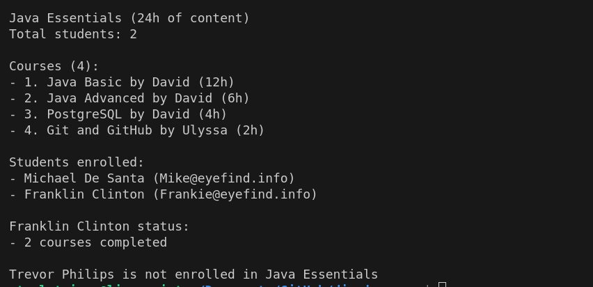

# DIO - Desafio POO

## Descrição

Desafio de projeto que consiste implementar os pilares da orientação objeto em Java de forma prática em uma aplicação que gerencia bootcamps.

## Modelagem de dados

O bootcamp é composto por cursos que possuem uma duração total e um instrutor específico. É possível monitorar quais alunos completaram cada curso. Além disso, o bootcamp também oferece métodos para matricular e remover alunos, bem como adicionar e remover cursos.

O sistema também inclui um método para calcular a duração total com base nos cursos oferecidos. Alunos e instrutores podem existir de forma independente de outras classes, proporcionando flexibilidade no gerenciamento de dados.

## Uso

Execute o arquivo `src/me/dio/App.java` para ver uma demonstração.
